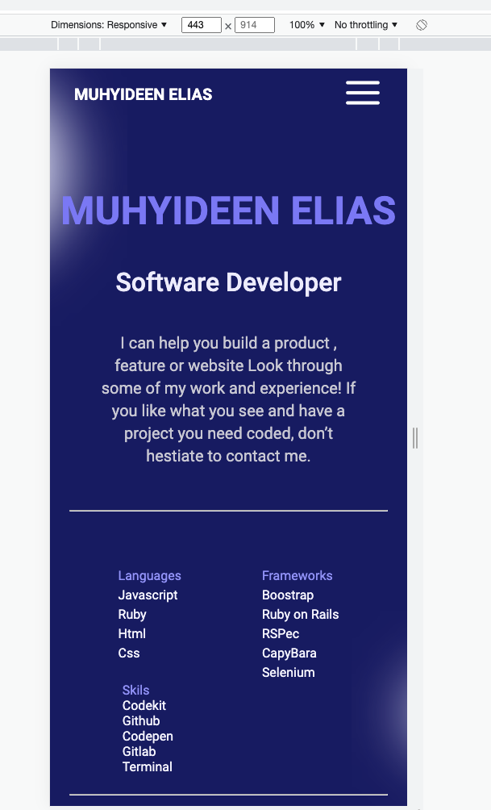

# Hello World

>This is my first project on my second day at Microverse and the goal for this project is to master all of the tools and best practices I have learned about in previous excercises. 

## Built With

- HTML, CSS, and Javascripts
- Node.js
- Webhint, Stylelint

## Getting Started

**Follow instruction at the RUN section to run the project.**

### RUN Project
#### - Clone project 
```
git clone https://github.com/Fourteen98/Hello-Microverse.git
```
#### - Open project directory and open index.html file with your prefered browser
####  - Expect the image below when the page loads

## Authors

👤 **Author1**

- GitHub: [@Fourteen98](https://github.com/Fourteen98)


## 🤝 Contributing

Contributions, issues, and feature requests are welcome!

Feel free to check the [issues page](../../issues/).

## Show your support

Give a ⭐️ if you like this project!

## Acknowledgments

- Hat tip to anyone whose code was used
- Inspiration
- etc

## 📝 License

This project is [MIT](./MIT.md) licensed.
