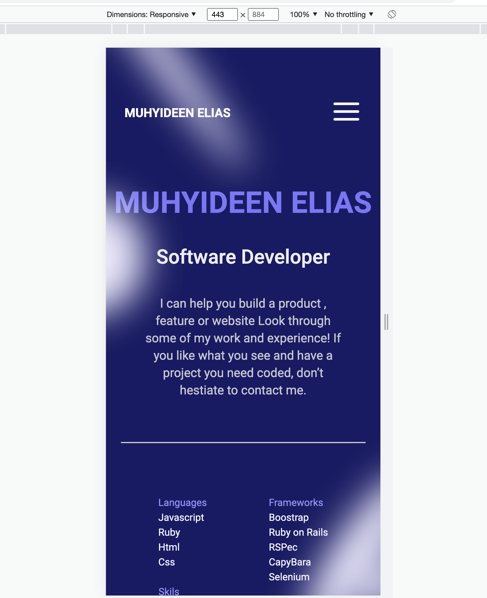

# Portfolio

> Portfolio is one of the most powerful tools in software developer toolbox. it is an easy way of showing what you are truly capable of as a developer, and a quick way for for recruiters to and hiring managers to get an idea of what you can bring to their team


## Built With

- HTML, CSS, and Javascripts
- Node.js
- Webhint, Stylelint

## Getting Started

**Follow instruction at the RUN section to run the project.**

### RUN Project
#### - Clone project 
```
git clone https://github.com/Fourteen98/My-Portfolio.git
```
#### - Open project directory and open index.html file with your prefered browser
####  - screenshot based on 443px screen size per specification giving in project.
##### Section 1

##### Section 2 and 3


##### Section 3


##### Section 4

## Authors

👤 **Author1**

- GitHub: [@Fourteen98](https://github.com/Fourteen98)


## 🤝 Contributing

Contributions, issues, and feature requests are welcome!

Feel free to check the [issues page](../../issues/).

## Show your support

Give a ⭐️ if you like this project!

## Acknowledgments

- Hat tip to anyone whose code was used
- Inspiration
- etc

## 📝 License

This project is [MIT](./MIT.md) licensed.
